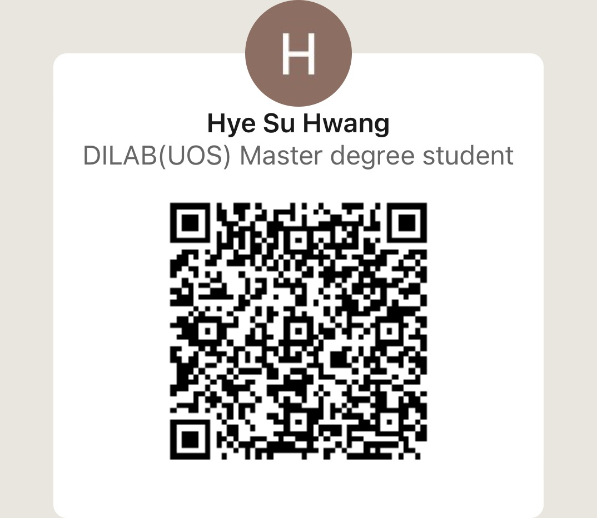

# Introduction

## English Version

---

💡 **Hyesu Hwang *(AI/ML Developer)***

I’m the person who creates the monetary value of data and develop with it.

---

### 💙Interests
- Artificial Intelligence & Deep learning (LLM/sLM/RAG/Multimodal)

### 👩‍🎓Education
- 2022~2024: Master’s in Urban Big Data Convergence Engineering, University of Seoul
- 2014~2019: Bachelor’s in Business Administration, University of Seoul

### 🏢Professional Experience
- 2024~    : Student Resaercher, Naver Cloud
- 2023~2024: Student Researcher, Electronics and Telecommunications Research Institute (ETRI)
- 2022~2024: Research Freelancer, Jiyoung Research
- 2019~2022: Cost Planning Intern and Full-time Employee, SL Corporation

### 📜Publications
- (2024) Bridging the Lexical Gap: Generative Text-to-Image Retrieval for Parts-of-Speech Imbalance in Vision-Language Models, Under Review
- (2024) Handling Ambiguous Queries Through Query Decomposition in a RAG Setting, CKAIA2024

### 💻Research
1. **Multimodal**
  - Development of long-term visual memory storage and management technology for relational information
  - Study on POS imbalance in VLMs and generative retrieval solutions (Paper Study)
  - Performance enhancement of VQA+RAG and efficiency research through context compression
  - Research on makeup transfer module based on GAN (Generative Adversarial Network)
2. **NLP/RAG**
  - Study on RAG performance based on query type
  - Development of RAG chatbot based on university researcher database
  - Development of search engine bot based on webtoon information
  - Study on RAG hallucination due to knowledge conflict
3. **Analysis**
  - Network analysis of local government tourism
 
### 🏭Experiences
1. **Server**
 - Server setting & managing based on Linux (Ubuntu OS)
 - Managing internal cost system & database based on SQL
 - Using SAP (ERP system)
2. **Manager of internal cost system & database**
 - 7% improvement in lamp surface defect rate with data
 - System updating and deployment
3. **Administration**
 - Advanced in MS Office tool (Word, Excel, PPT)
 - The person in charge of Cost Education (Make materials, Manage students)

### 📞Contact
- Email: agnas5865@gmail.com
- LinkedIN:

---

## 한글 버전

---

💡 **황혜수 *(AI/ML 개발자)***

데이터의 화폐적 가치를 창출하여 데이터와 함께 성장하는 황혜수입니다.

---

### 💙관심 분야
- 인공지능 & 딥러닝 (LLM/sLM/RAG/Multimodal)

### 👩‍🎓학력
- 2022~2024: 서울시립대학교 도시빅데이터융합학과 공학 석사
- 2014~2019: 서울시립대학교 경영학부 학사

### 🏢경력
- 2024~    : Naver Cloud 학생연구원
- 2023~2024: 한국전자통신연구원(ETRI) 학생연구원
- 2022~2024: 지영리서치 연구용역 프리랜서
- 2019~2022: (주)에스엘 원가기획 인턴 및 정직원

### 📜논문
- (2024) Bridging the Lexical Gap: Generative Text-to-Image Retrieval for Parts-of-Speech Imbalance in Vision-Language Model, Under Review
- (2024) Handling Ambiguous Queries Through Query Decomposition in a RAG Setting, CKAIA2024

### 💻연구
1. **멀티모달**
  - 관계 정보의 장기 시각 기억 저장 및 관리 기술 개발
  - VLMs의 POS imbalance 문제 발견 및 Generative retrieval을 통한 문제 해결 연구 (Paper Study)
  - VQA+RAG의 성능 개선 및 Context compression을 통한 효율 연구
  - GAN(Generative Adversarial Network) 기반의 Makeup Transfer 모듈 연구
2. **NLP/RAG**
  - Query type에 따른 RAG 성능 연구
  - 교내 연구자 데이터베이스 기반의 RAG 챗봇 개발
  - 웹툰 정보 기반의 검색 엔진 봇 개발
  - Knowledge conflict로 인한 RAG Hallucination 연구
3. **분석**
  - 지자체 관광 네트워크 분석
    
### 🏭경험
1. **서버**
 - Linux 기반의 서버 셋팅 & 관리 (Ubuntu OS)
 - SQL 기반의 사내 원가 시스템 & 데이터베이스 관리
 - SAP 활용 (ERP system)
2. **사내 원가 시스템 매니저**
 - Data를 활용하여 램프 표면 불량률 7% 개선
 - 시스템 업데이트 및 배포
3. **행정**
 - MS Office (Word, Excel, PPT) 숙련도 상(上)
 - 원가 교육 담당자 (교육자료 제작 및 수강생 관리)
   
### 📞연락처
- 이메일: agnas5865@gmail.com
- LinkedIN:

